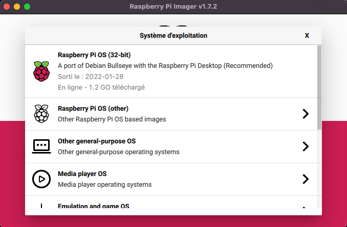

# rpi-k8s-cluster
A HA Kubernetes cluster on Raspberry Pi

<!-- TOC -->

- [rpi-k8s-cluster](#rpi-k8s-cluster)
  - [Install Ubuntu on SD card](#install-ubuntu-on-sd-card)
    - [Format SD card and installing the Ubuntu 20.04.4 LTS 64](#format-sd-card-and-installing-the-ubuntu-20044-lts-64)
    - [Change the password](#change-the-password)
  - [Configure the cluster](#configure-the-cluster)
    - [Configure the `cluster.yml` file](#configure-the-clusteryml-file)
    - [Verify all hosts are accessible](#verify-all-hosts-are-accessible)
    - [Over clocking all rpis](#over-clocking-all-rpis)
  - [Create the Kubernetes cluster](#create-the-kubernetes-cluster)

<!-- /TOC -->

## Install Ubuntu on SD card 

### Format SD card and installing the Ubuntu 20.04.4 LTS 64





### Change the password

```
ssh ssh ubuntu@10.11.13.21

The authenticity of host '10.11.13.21 (10.11.13.21)' can't be established.
ED25519 key fingerprint is SHA256:Qz8VvXybEzMas22gvl6SEHX+pb1pH9GhWRgo2cg62cw.
This key is not known by any other names
Are you sure you want to continue connecting (yes/no/[fingerprint])? yes
Warning: Permanently added '10.11.13.21' (ED25519) to the list of known hosts.
ubuntu@10.11.13.21's password:
You are required to change your password immediately (administrator enforced)
Welcome to Ubuntu 20.04.4 LTS (GNU/Linux 5.4.0-1056-raspi aarch64)

 * Documentation:  https://help.ubuntu.com
 * Management:     https://landscape.canonical.com
 * Support:        https://ubuntu.com/advantage

  System information as of Thu Mar 31 13:46:44 UTC 2022

  System load:  0.37               Temperature:           29.7 C
  Usage of /:   2.2% of 116.90GB   Processes:             138
  Memory usage: 2%                 Users logged in:       0
  Swap usage:   0%                 IPv4 address for eth0: 10.11.13.21

 * Super-optimized for small spaces - read how we shrank the memory
   footprint of MicroK8s to make it the smallest full K8s around.

   https://ubuntu.com/blog/microk8s-memory-optimisation

20 updates can be applied immediately.
To see these additional updates run: apt list --upgradable


The programs included with the Ubuntu system are free software;
the exact distribution terms for each program are described in the
individual files in /usr/share/doc/*/copyright.

Ubuntu comes with ABSOLUTELY NO WARRANTY, to the extent permitted by
applicable law.

WARNING: Your password has expired.
You must change your password now and login again!
Changing password for ubuntu.
Current password:
```

The default password of the ubuntu user is `ubuntu`.

```
New password:
Retype new password:
passwd: password updated successfully
Connection to 10.11.13.23 closed.
```

Set your new paswword (ex: raspberry) and reconnect with ssh.


## Configure the cluster

### Configure the `cluster.yml` file

[cluster.yml](cluster.yml)

```yaml
all:
  vars:
    ansible_connection: ssh
    ansible_user: ubuntu
    ansible_ssh_pass: raspberry
    ansible_become: true
    ansible_become_user: root
    ansible_python_interpreter: /usr/bin/python3
  hosts:
    rpi-k8s-lba-01:
      ansible_host: 10.11.13.20
    rpi-k8s-master-01:
      ansible_host: 10.11.13.21
    rpi-k8s-master-02:
      ansible_host: 10.11.13.22
    rpi-k8s-master-03:
      ansible_host: 10.11.13.23
    rpi-k8s-worker-01:
      ansible_host: 10.11.13.31
    rpi-k8s-worker-02:
      ansible_host: 10.11.13.32
    rpi-k8s-worker-03:
      ansible_host: 10.11.13.33
  children:
    load_balancer:
      hosts:
        rpi-k8s-lba-01:
      vars:
        node: "lba"
        # List of backend servers.
        backend_servers:
          - name: rpi-k8s-master-01
            address: 10.11.13.21
          - name: rpi-k8s-master-02
            address: 10.11.13.22
          - name: rpi-k8s-master-03
            address: 10.11.13.23
    master:
      hosts:
        rpi-k8s-master-01:
          primary_master: true
          lba_ip: 10.11.13.20
        rpi-k8s-master-02:
        rpi-k8s-master-03:
      vars:
        node: "master"
    worker:
      hosts:
        rpi-k8s-worker-01:
        rpi-k8s-worker-02:
        rpi-k8s-worker-03:
      vars:
        node: "worker"
    rpi3bp:
      hosts:
        rpi-k8s-lba-01:
        rpi-k8s-worker-01:
        rpi-k8s-master-02:
        rpi-k8s-master-03:
    rpi4:
      hosts:
        rpi-k8s-master-01:
        rpi-k8s-worker-02:
        rpi-k8s-worker-03:
```

### Verify all hosts are accessible

Use the ansible playbook `check-hosts.yml` to check hosts.

```
ansible-playbook -i cluster.yml ansible/playbooks/check-hosts.yml
```

You will see that at the end:

```
...

rpi-k8s-lba-01             : ok=15   changed=0    unreachable=0    failed=0    skipped=0    rescued=0    ignored=0
rpi-k8s-master-01          : ok=15   changed=0    unreachable=0    failed=0    skipped=0    rescued=0    ignored=0
rpi-k8s-master-02          : ok=15   changed=0    unreachable=0    failed=0    skipped=0    rescued=0    ignored=0
rpi-k8s-master-03          : ok=15   changed=0    unreachable=0    failed=0    skipped=0    rescued=0    ignored=0
rpi-k8s-worker-01          : ok=15   changed=0    unreachable=0    failed=0    skipped=0    rescued=0    ignored=0
rpi-k8s-worker-02          : ok=15   changed=0    unreachable=0    failed=0    skipped=0    rescued=0    ignored=0
rpi-k8s-worker-03          : ok=15   changed=0    unreachable=0    failed=0    skipped=0    rescued=0    ignored=0
```

### Over clocking all rpis

Use the ansible playbook `check-hosts.yml` to check hosts.

```
ansible-playbook -i cluster.yml ansible/playbooks/check-hosts.yml
```


## Create the Kubernetes cluster

```
ansible-playbook -i cluster.yml ansible/site.yml
```

