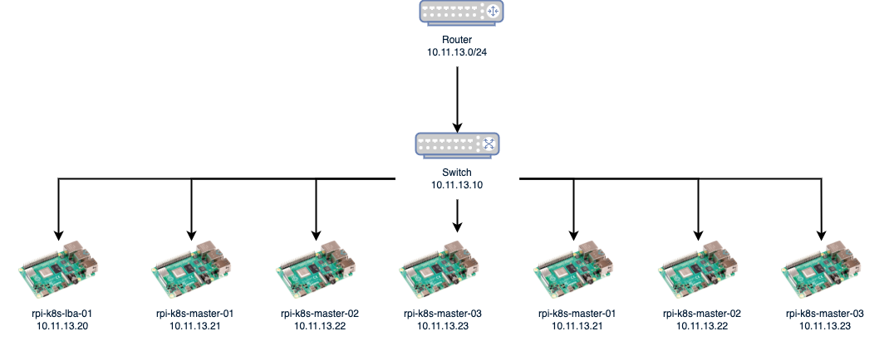
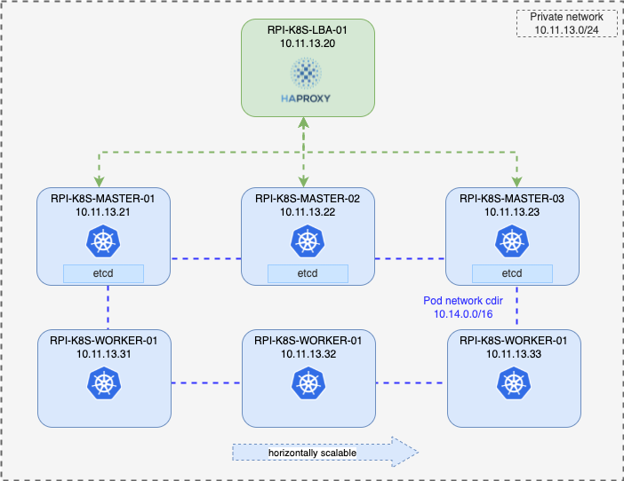
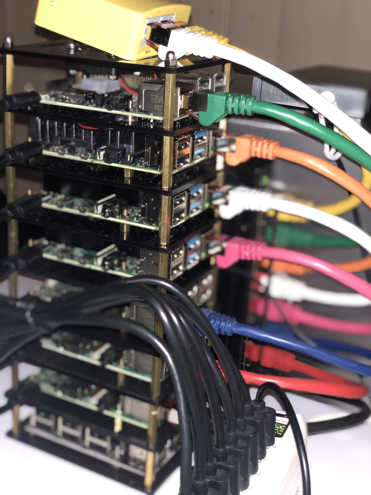
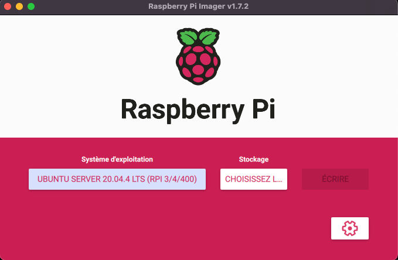
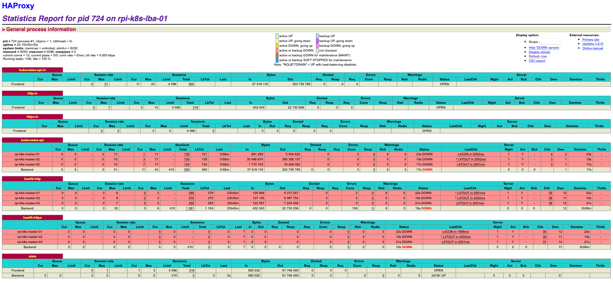
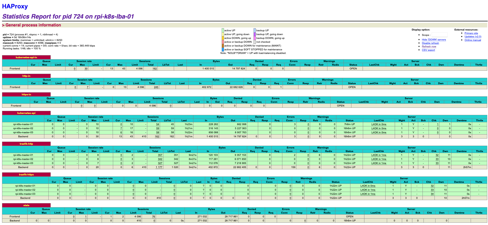
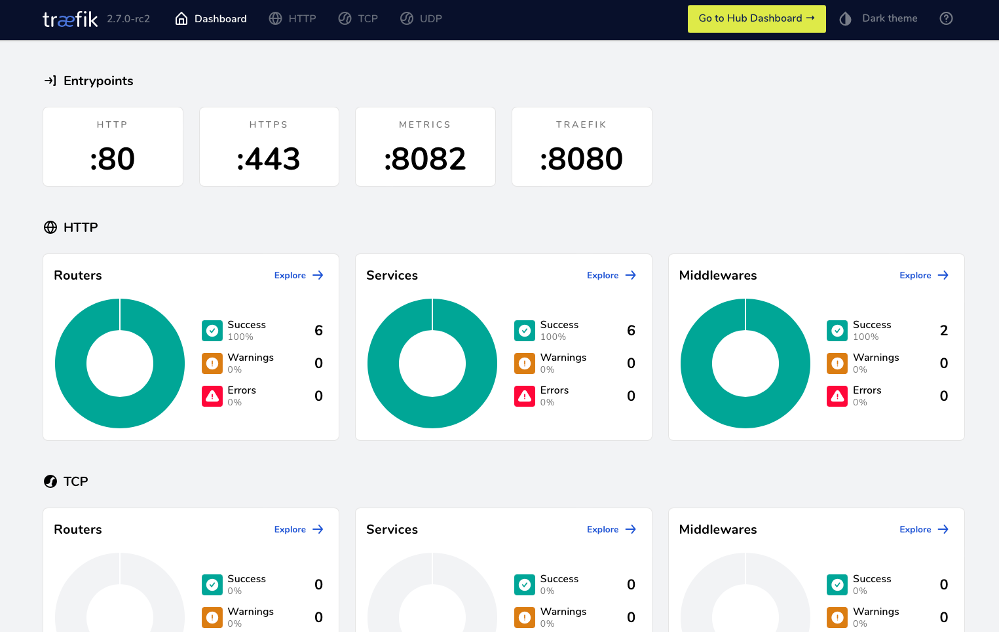

# HA Kubernetes cluster on Raspberry Pi

This cluster is used daily to carry out my personnal and professional projects (poc, deployment strategies, ci/cd, ...).

<!-- TOC -->

- [HA Kubernetes cluster on Raspberry Pi](#ha-kubernetes-cluster-on-raspberry-pi)
  - [Architecture](#architecture)
    - [Infrastructure](#infrastructure)
    - [High level Kubernetes cluster](#high-level-kubernetes-cluster)
  - [Materials](#materials)
  - [Let's get started](#lets-get-started)
    - [1. Install Ubuntu Server OS for all nodes](#1-install-ubuntu-server-os-for-all-nodes)
    - [2. Change the default password](#2-change-the-default-password)
    - [3. Configure the cluster](#3-configure-the-cluster)
    - [4. Check all hosts are accessible via SSH with Ansible](#4-check-all-hosts-are-accessible-via-ssh-with-ansible)
    - [5. Update hosts and upgrade OS](#5-update-hosts-and-upgrade-os)
    - [6. Overclocking all RPI nodes](#6-overclocking-all-rpi-nodes)
  - [Deploy the HAProxy and Kubernetes cluster](#deploy-the-haproxy-and-kubernetes-cluster)
    - [1. Install common packages on all nodes](#1-install-common-packages-on-all-nodes)
    - [2. Install the load balancer **HAProxy**](#2-install-the-load-balancer-haproxy)
    - [3. Install Docker and Kubernetes](#3-install-docker-and-kubernetes)
    - [4. Download the Kubernetes configuration](#4-download-the-kubernetes-configuration)
    - [5. Check the cluster status](#5-check-the-cluster-status)
    - [6. Deploy Traefik as ingress controller](#6-deploy-traefik-as-ingress-controller)
  - [How to manage the cluster ?](#how-to-manage-the-cluster-)
    - [Upgrade the K8S cluster](#upgrade-the-k8s-cluster)
    - [Destroy the K8S cluster](#destroy-the-k8s-cluster)

<!-- /TOC -->

## Architecture

### Infrastructure



### High level Kubernetes cluster



## Materials



* 6 Raspberry PI 4B for the Kubernetes (K8S) cluster
  - 3 RPI 4B 4Go for master nodes
  - 3 RPI 4B 8Go for worker nodes
* 1 Raspberry PI 3B+ for the load balancer (LBA) node
* 7 micro SD cards
  - 1 => 32G (for LBA node)
  - 6 => 128G (for K8S cluster nodes)
* 1 Ethernet Network Switch with 8 ports
- 1 Wireless Portable/Travel router
* 1 USB charger 60W with 8 usb ports
- 1 Raspberry PI cluster case
- 6 USB-C cables for RPI 4B
- 2 USB-A cables (LBA and Wifi router)
- 8 RJ45 cables Cat. 6

## Let's get started

### 1. Install Ubuntu Server OS for all nodes

I use the [Raspberry Imager](https://www.raspberrypi.com/software/) tool to install the Ubuntu 20.04.4 LTS 64 on each micro sd card.




### 2. Change the default password

The default password of the ubuntu user is `ubuntu`.

```
ssh ubuntu@10.11.13.21

...
...
...

New password:
Retype new password:
passwd: password updated successfully
Connection to 10.11.13.23 closed.
```

Set the new password and reconnect with ssh.

### 3. Configure the cluster

In this step, we configure the Ansible inventory file ([cluster.yml](cluster.yml)) to match with our RPI cluster.

```yaml
all:
  vars:
    ansible_connection: ssh
    ansible_user: ubuntu
    ansible_ssh_pass: raspberry
    ansible_become: true
    ansible_become_user: root
    ansible_python_interpreter: /usr/bin/python3
  hosts:
    rpi-k8s-lba-01:
      ansible_host: 10.11.13.20
    rpi-k8s-master-01:
      ansible_host: 10.11.13.21
    rpi-k8s-master-02:
      ansible_host: 10.11.13.22
    rpi-k8s-master-03:
      ansible_host: 10.11.13.23
    rpi-k8s-worker-01:
      ansible_host: 10.11.13.31
    rpi-k8s-worker-02:
      ansible_host: 10.11.13.32
    rpi-k8s-worker-03:
      ansible_host: 10.11.13.33
  children:
    load_balancer:
      hosts:
        rpi-k8s-lba-01:
      vars:
        node: "lba"
        # List of backend servers.
        backend_servers:
          - name: rpi-k8s-master-01
            address: 10.11.13.21
          - name: rpi-k8s-master-02
            address: 10.11.13.22
          - name: rpi-k8s-master-03
            address: 10.11.13.23
    master:
      hosts:
        rpi-k8s-master-01:
          primary_master: true
          lba_ip: 10.11.13.20
        rpi-k8s-master-02:
        rpi-k8s-master-03:
      vars:
        node: "master"
    worker:
      hosts:
        rpi-k8s-worker-01:
        rpi-k8s-worker-02:
        rpi-k8s-worker-03:
      vars:
        node: "worker"
...
```

### 4. Check all hosts are accessible via SSH with Ansible

Let's use the ansible playbook `check.yml` to check all the cluster hosts.

```
ansible-playbook -i cluster.yml ansible/playbooks/check.yml
```

```
...
rpi-k8s-lba-01             : ok=15   changed=0    unreachable=0    failed=0    skipped=0    rescued=0    ignored=0
rpi-k8s-master-01          : ok=15   changed=0    unreachable=0    failed=0    skipped=0    rescued=0    ignored=0
rpi-k8s-master-02          : ok=15   changed=0    unreachable=0    failed=0    skipped=0    rescued=0    ignored=0
rpi-k8s-master-03          : ok=15   changed=0    unreachable=0    failed=0    skipped=0    rescued=0    ignored=0
rpi-k8s-worker-01          : ok=15   changed=0    unreachable=0    failed=0    skipped=0    rescued=0    ignored=0
rpi-k8s-worker-02          : ok=15   changed=0    unreachable=0    failed=0    skipped=0    rescued=0    ignored=0
rpi-k8s-worker-03          : ok=15   changed=0    unreachable=0    failed=0    skipped=0    rescued=0    ignored=0
``` 

All the cluster nodes are OK ;)

### 5. Update hosts and upgrade OS

We can use these following Ansible playbooks to upgrade OS.

```
ansible-playbook -i cluster.yml ansible/playbooks/update-host.yml
```

```
ansible-playbook -i cluster.yml ansible/playbooks/upgrade.yml
```

It takes a few minutes to upgrade all the cluster nodes.

### 6. Overclocking all RPI nodes

Now, let's overclock all the RPI nodes with the ansible playbook `overclock.yml`.

```
ansible-playbook -i cluster.yml ansible/playbooks/overclock.yml
```

## Deploy the HAProxy and Kubernetes cluster

### 1. Install common packages on all nodes

```
ansible-playbook -i cluster.yml ansible/site.yml --tags common
```

### 2. Install the load balancer **HAProxy**

```
ansible-playbook -i cluster.yml ansible/site.yml --tags lba
```

After installation, we can take a look at our HAProxy dashboard at http://10.11.13.20:8080/stats



All our backends servers are **red** because we haven't installed Kubernetes and [Traefik](https://traefik.io/) yet.

### 3. Install Docker and Kubernetes

```
ansible-playbook -i cluster.yml ansible/site.yml --tags kubernetes
```

Now we can go to take a coffee and come back later (5-10 minutes).

### 4. Download the Kubernetes configuration

```
ansible-playbook -i cluster.yml ansible/playbooks/copy-kubernetes-config.yml
```

This playbook will copy the `.kube/config` file in our local host under the `~/.kube` directory. The file is named `cluster-k8s-rpi-config`.

### 5. Check the cluster status

```
kubectl get nodes

NAME                STATUS   ROLES                  AGE     VERSION
rpi-k8s-master-01   Ready    control-plane,master   2d10h   v1.23.5
rpi-k8s-master-02   Ready    control-plane,master   2d10h   v1.23.5
rpi-k8s-master-03   Ready    control-plane,master   2d10h   v1.23.5
rpi-k8s-worker-01   Ready    <none>                 2d10h   v1.23.5
rpi-k8s-worker-02   Ready    <none>                 2d10h   v1.23.5
rpi-k8s-worker-03   Ready    <none>                 2d10h   v1.23.5
```

### 6. Deploy Traefik as ingress controller

Our Kubenetes cluster is running, let's deploy Traefik included in the `addons` directory.

```
kubectl create namespace proxy
kubectl apply -f addons/traefik
```

Now all our backend servers should be in green state.



Let's put the domain `traefik.rpi.lan` in the `/etc/hosts` to view the Traefik dashboard.

```
...
...

10.11.13.20 traefik.rpi.lan
```

The Traefik dashboard is now available at http://traefik.rpi.lan



## How to manage the cluster ?

### Upgrade the K8S cluster


### Destroy the K8S cluster